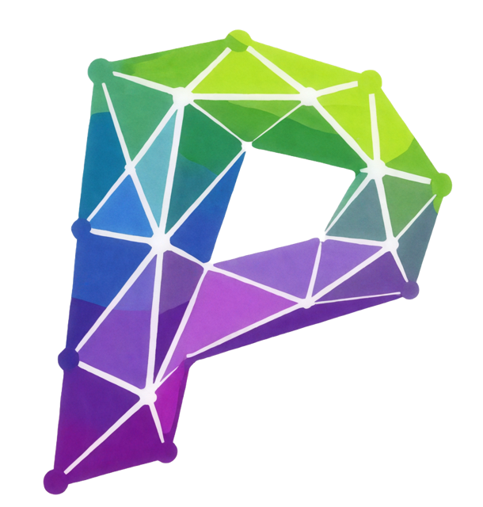

Polyhedron Documentation
========================

**A domain-driven Python optimization modeling framework with built-in quality
and governance tooling.**

Polyhedron is a Python optimization modeling framework for teams that need more than
just "build model and solve." It combines a domain-driven modeling DSL with practical
quality and governance tooling so models can be maintained, reviewed, and operated
reliably over time.

Unlike many libraries that focus primarily on algebraic model expression, Polyhedron
puts emphasis on how optimization software is actually used in production:
clear domain abstractions, indexed decision structures, repeatable diagnostics,
scenario workflows, and regression checks that detect unintended behavior changes
before release.

.. grid:: 1 1 2 2
   :gutter: 3

   .. grid-item-card:: Modeling Patterns

      Indexed structures, graph flow models, multi-objective declarations,
      selection/assignment helpers, staged decisions, and time horizons.
      :doc:`Browse the guides → <modeling-patterns>`

   .. grid-item-card:: Quality And Diagnostics

      Linting, explainability, infeasibility diagnostics, sensitivity analysis,
      risk primitives, and scenario/regression workflows.
      :doc:`See the tooling → <quality-and-diagnostics>`

.. grid:: 2 2 3 3
   :gutter: 3

   .. grid-item-card:: Installation
      :link: installation
      :link-type: doc

      Requirements, optional solver extras, and installing from source.

   .. grid-item-card:: Quickstart
      :link: quickstart
      :link-type: doc

      A minimal model, guided walkthroughs, and curated example programs.

   .. grid-item-card:: Concepts
      :link: concepts
      :link-type: doc

      Architecture layers and how Polyhedron differs from general modeling
      libraries.

   .. grid-item-card:: Modeling Patterns
      :link: modeling-patterns
      :link-type: doc

      Indexed modeling, graph flow, multi-objective, selection/assignment,
      state/staged, temporal, and units/contracts.

   .. grid-item-card:: Quality And Diagnostics
      :link: quality-and-diagnostics
      :link-type: doc

      Linting, explainability, sensitivity, risk and uncertainty, scenarios,
      and regression checks.

   .. grid-item-card:: Solvers And Interop
      :link: solvers-and-interop
      :link-type: doc

      Backend configuration, warm starts, Pyomo bridges, and MPS/LP export
      and import.

Minimal Working Example
------------------------

.. code-block:: python

   from polyhedron import Element, Model, minimize

   class Plant(Element):
       production = Model.ContinuousVar(min=0, max=80, unit="MW")

       @minimize(name="cost")
       def cost(self):
           return 18 * self.production

   model = Model("landing-demo")
   p = Plant("p1")
   model.add_element(p)

   @model.constraint(name="demand")
   def demand():
       return p.production >= 40

   solved = model.solve(return_solved_model=True)
   print(solved.status, solved.get_value(p.production))

Where To Start
---------------

- Installation and setup: :doc:`installation`
- First solve in a few lines, plus guided walkthroughs: :doc:`quickstart`
- Core concepts and architecture: :doc:`concepts`
- Modeling patterns (indexed, graph, multi-objective, staged, temporal): :doc:`modeling-patterns`
- Quality, diagnostics, risk, and regression workflows: :doc:`quality-and-diagnostics`
- Solver configuration and Pyomo/MPS/LP interop: :doc:`solvers-and-interop`
- Full API and module reference: :doc:`api`

.. toctree::
   :maxdepth: 2
   :hidden:

   installation
   quickstart
   concepts
   modeling-patterns
   quality-and-diagnostics
   solvers-and-interop
   api
